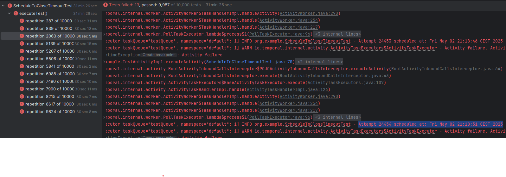
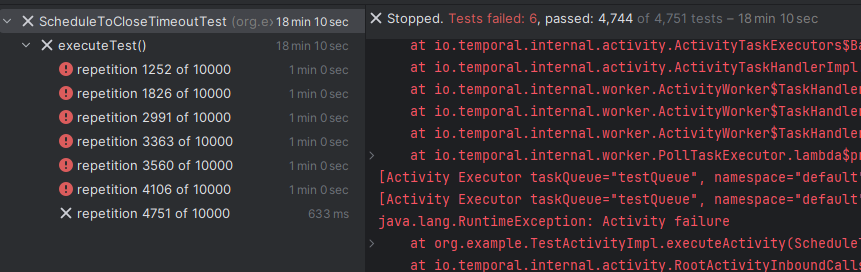

In about 0,1% cases TestWorkflowEnvironment doesn't respect activity ScheduleToCloseTimeout



Execute [ScheduleToCloseTimeoutTest](./src/test/java/org/example/ScheduleToCloseTimeoutTest.java)

Activity stub has settings:
* ScheduleToCloseTimeout = 30 seconds
* MaximumAttempts = 0 
* BackoffCoefficient = 1
* InitialInterval = 5 seconds

Usual run looks like this: 
```
Before run: Thu May 01 11:15:06 CEST 2025
Attempt 1 scheduled at: Thu May 01 11:15:06 CEST 2025
...
Attempt 6 scheduled at: Thu May 01 11:15:26 CEST 2025
After run: Thu May 01 11:15:41 CEST 2025
```
Because of time skipping test takes < 1 seconds.

However about 0,1% or runs look like this:
```
Before run: Thu May 01 11:15:06 CEST 2025
Attempt 1 scheduled at: Thu May 01 11:15:06 CEST 2025
...
Attempt 24454 scheduled at: Fri May 02 21:18:51 CEST 2025
java.util.concurrent.TimeoutException: executeTest() timed out after 30 seconds
```

Although > 24 hours of temporal time is passed since first activity attempt, 
temporalio doesn't fails activity, which leads to test timeout.

Increasing test timeout to 60 seconds doesn't help, 
so issue does not caused by temporal VS real time thing: 
